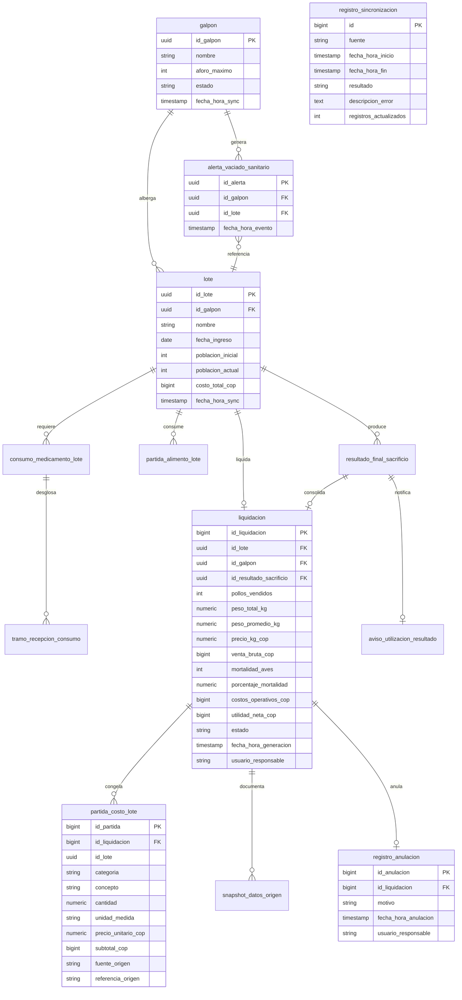

# General — Arquitectura y Stack Tecnológico

**Estado**: Referencia técnica transversal del Módulo 3  
**Fecha**: 03/10/2026  
**Diccionario de Dominio y Base de Datos**: [Diccionario.md](../Diccionario.md)  

## Propósito

Este documento define la arquitectura, las tecnologías, el modelo de datos relacional (DER y DDL SQL), la infraestructura de integración (@Scheduled, Kafka y Apache POI) y las reglas técnicas comunes de AviControl Módulo 3 (Liquidación de Lote y Análisis de Rentabilidad). Es la fuente única de verdad para estas decisiones: los planes de implementación funcionales deben enlazar este archivo y documentar únicamente su alcance, modelos, contratos y tareas de implementación.

---

## Stack Tecnológico

| Área | Tecnología adoptada | Uso en el proyecto |
| --- | --- | --- |
| Lenguaje | Java 21 (LTS) | Dominio, casos de uso, adaptadores y pruebas |
| Framework principal | Spring Boot 3.3.x | Configuración, ejecución y composición de la aplicación REST |
| Construcción | Gradle (`build.gradle`) | Gestión de dependencias, compilación y empaquetado |
| API HTTP | Spring Web MVC | Controladores REST síncronos |
| Validación | Jakarta Bean Validation | Validación de DTOs en adaptadores de entrada |
| Seguridad | Spring Security | Autenticación JWT y autorización por rol (ej. `ROLE_FINANCIERO`) |
| Persistencia | Spring Data JPA + Hibernate | Repositorios y entidades JPA |
| Base de datos | PostgreSQL (prod) / H2 (dev/test) | Almacenamiento de copia local y liquidaciones |
| Migraciones | Flyway (`flyway-core`) | Versionamiento y aplicación ordenada del esquema SQL |
| Mensajería inter-módulos | Apache Kafka + Spring Kafka | Integración asíncrona por eventos con Módulo 1 y Módulo 2 |
| Exportación de reportes | Apache POI `poi-ooxml:5.2.5` | Generación de reportes Excel (CU05) |
| Serialización | Jackson | JSON para API REST y contratos de integración |
| Documentación API | OpenAPI 3 (`springdoc-openapi`) | Descripción interactiva de endpoints en `/swagger-ui.html` |
| Pruebas unitarias | JUnit 5 y Mockito | Reglas de dominio y casos de uso aislados |
| Pruebas de integración | Spring Boot Test + Testcontainers | PostgreSQL y Kafka reales durante las pruebas |
| Utilidades | Lombok | Reducción de código repetitivo |
| Calidad y arquitectura | Spotless y ArchUnit | Formato uniforme y verificación de límites entre capas |
| Observabilidad | Spring Boot Actuator y Micrometer | Salud (`/actuator/health`) y métricas operativas |
| Entorno local | Docker Compose | PostgreSQL y Kafka para desarrollo local |
| Abstracción de tiempo | `java.time.Clock` | Fecha/hora inyectada para auditabilidad y pruebas deterministas |

---

## Arquitectura Limpia por Capas

El Módulo 3 se implementa con **Arquitectura Limpia por Capas**. Las dependencias siempre apuntan hacia adentro: la infraestructura depende del servicio, y el servicio depende del dominio. El dominio no conoce nada de las capas externas.

```text
co.edu.unimagdalena.avicontrol/
├── domain/                            ← Núcleo. Cero dependencias externas.
│   ├── model/                         ← Entidades puras: Liquidacion, Lote, Galpon…
│   ├── port/
│   │   ├── in/                        ← Interfaces de casos de uso (Puertos de entrada)
│   │   │   ├── ListarLotesUseCase.java
│   │   │   ├── GenerarLiquidacionUseCase.java
│   │   │   ├── PreviewLiquidacionUseCase.java
│   │   │   ├── ConsultarLiquidacionUseCase.java
│   │   │   ├── AnularLiquidacionUseCase.java
│   │   │   ├── ConsultarHistorialUseCase.java
│   │   │   ├── ConsultarDesgloseUseCase.java
│   │   │   ├── ExportarExcelUseCase.java
│   │   │   └── dto/                   ← DTOs de casos de uso (Arquitectura Limpia Estricta) ★
│   │   │       ├── LoteResumenDto.java
│   │   │       ├── LotePageDto.java
│   │   │       ├── LiquidacionPreviaDto.java
│   │   │       ├── LiquidacionDto.java
│   │   │       ├── AnulacionDto.java
│   │   │       ├── HistorialFiltroDto.java
│   │   │       └── DesgloseDto.java
│   │   └── out/                       ← Interfaces de repositorios y gateways (Puertos de salida)
│   │       ├── LoteRepository.java
│   │       ├── LiquidacionRepository.java
│   │       ├── AlertaVaciadoSanitarioRepository.java
│   │       ├── Modulo1Port.java
│   │       └── Modulo2SacrificioPort.java
│   └── shared/                        ← Reglas transversales: Rounding.java
│
├── application/                       ← Servicios de aplicación. Orquesta dominio.
│   └── service/
│       ├── ListarLotesService.java
│       ├── GenerarLiquidacionService.java
│       ├── ConsultarLiquidacionService.java
│       ├── AnularLiquidacionService.java
│       ├── ConsultarHistorialService.java
│       ├── ConsultarDesgloseService.java
│       ├── ExportarExcelService.java
│       └── sync/
│           ├── SyncModulo1Service.java
│           ├── SyncSacrificioService.java
│           ├── SyncAlimentoService.java
│           └── SyncMedicamentoService.java
│
└── infrastructure/                    ← Adaptadores técnicos. Conoce Spring, JPA, Kafka.
    ├── adapter/
    │   ├── rest/                      ← Controladores HTTP de entrada
    │   │   ├── LoteController.java
    │   │   ├── LiquidacionController.java
    │   │   ├── DesgloseController.java
    │   │   └── HistorialController.java
    │   ├── client/                    ← Adaptadores de salida: REST y Kafka hacia M1 y M2
    │   │   ├── Modulo1RestAdapter.java
    │   │   ├── SacrificioKafkaListener.java
    │   │   └── AvisoUtilizacionRestAdapter.java
    │   └── persistence/               ← Entidades JPA (@Entity), Repositories Spring Data y Mappers
    ├── config/                        ← Configuración: JWT, OpenAPI, Scheduler, Clock, Actuator
    └── exception/                     ← @ControllerAdvice → ProblemDetail RFC 7807
```

> **★ Regla de Dependencias (Arquitectura Limpia Estricta)**: 
> 1. Los DTOs consumidos o retornados por los casos de uso se ubican en `co.edu.unimagdalena.avicontrol.domain.port.in.dto` como `record`s de Java puro.
> 2. La capa `domain/` **NUNCA importa clases de `application/` ni de `infrastructure/`**. Todas las dependencias apuntan exclusivamente hacia el centro del dominio.
> 3. Los mappers que transforman entre entidades JPA y DTOs de dominio residen en la capa de `infrastructure` o `application`.

### Capa `domain/`
Contiene el modelo de negocio puro: entidades (`Liquidacion`, `Galpon`, `Lote`, etc.), enums, value objects, reglas de redondeo, interfaces de repositorios (`port/out`), puertos de entrada de casos de uso (`port/in`) y sus DTOs asociados (`port/in/dto`).
- **Regla estricta**: Java puro. No importa Spring, JPA, Jackson, Kafka ni clases de las capas externas (`application` o `infrastructure`).

### Capa `application/` (Servicios)
Contiene los servicios de aplicación que implementan las interfaces `port/in`, orquestan el dominio y coordinan la sincronización periódica con M1 y M2. Define el límite transaccional (`@Transactional`) y no conoce detalles de controladores HTTP, JPA ni serialización.

### Capa `infrastructure/`
Contiene los adaptadores concretos:
- **`adapter/rest/`**: Controladores REST API (entrada HTTP).
- **`adapter/client/`**: Clientes REST y listeners Kafka para consumir y publicar eventos con Módulo 1 y Módulo 2.
- **`adapter/persistence/`**: Entidades JPA (`@Entity`), repositorios Spring Data y mappers hacia el dominio.
- **`config/`**: Configuración de Spring Security (JWT), OpenAPI, Scheduler, Clock, Actuator.
- **`exception/`**: Manejador global de excepciones (`@ControllerAdvice`) con RFC 7807 (`ProblemDetail`).

---

## Modelo de Datos Relacional (DER y DDL SQL)

### A. Diagrama Entidad-Relación (DER en Mermaid)



> **Nota — Restricciones UNIQUE**: Mermaid `erDiagram` no admite múltiples calificadores en un atributo. Las siguientes restricciones existen en el DDL aunque no se representan con `UK` en el diagrama:
> - `liquidacion.id_lote` → `CONSTRAINT uq_lote_activa UNIQUE (id_lote)` — máximo una Liquidación `ACTIVA` por lote.
> - `registro_anulacion.id_liquidacion` → `UNIQUE` — una sola anulación por Liquidación.

---


### B. Scripts SQL DDL Completos (Flyway Migrations)

#### `V1__create_sync_tables.sql`
```sql
CREATE TABLE registro_sincronizacion (
    id                BIGSERIAL PRIMARY KEY,
    fuente            VARCHAR(20) NOT NULL,
    fecha_hora_inicio TIMESTAMP NOT NULL,
    fecha_hora_fin    TIMESTAMP,
    resultado         VARCHAR(20),
    descripcion_error TEXT,
    registros_actualizados INT DEFAULT 0
);

CREATE TABLE galpon (
    id_galpon     UUID PRIMARY KEY,
    nombre        VARCHAR(100) NOT NULL,
    aforo_maximo  INT NOT NULL,
    estado        VARCHAR(30) NOT NULL,
    fecha_hora_sync TIMESTAMP NOT NULL
);

CREATE TABLE lote (
    id_lote            UUID PRIMARY KEY,
    id_galpon          UUID NOT NULL REFERENCES galpon(id_galpon),
    nombre             VARCHAR(100) NOT NULL,
    fecha_ingreso      DATE NOT NULL,
    poblacion_inicial  INT NOT NULL,
    poblacion_actual   INT NOT NULL,
    costo_total_cop    BIGINT NOT NULL,
    fecha_hora_sync    TIMESTAMP NOT NULL
);

CREATE TABLE alerta_vaciado_sanitario (
    id_alerta        UUID PRIMARY KEY,
    id_galpon        UUID NOT NULL REFERENCES galpon(id_galpon),
    id_lote          UUID NOT NULL REFERENCES lote(id_lote),
    fecha_hora_evento TIMESTAMP NOT NULL,
    fecha_hora_sync   TIMESTAMP NOT NULL
);

CREATE TABLE resultado_final_sacrificio (
    id_resultado       UUID PRIMARY KEY,
    id_lote            UUID NOT NULL REFERENCES lote(id_lote),
    id_galpon          UUID NOT NULL REFERENCES galpon(id_galpon),
    cantidad_final_pollos INT NOT NULL,
    peso_total_kg      NUMERIC(12,2) NOT NULL,
    fecha_registro     TIMESTAMP NOT NULL,
    fecha_hora_sync    TIMESTAMP NOT NULL,
    estado_utilizacion VARCHAR(20) NOT NULL DEFAULT 'NO_UTILIZADO'
);

CREATE TABLE aviso_utilizacion_resultado (
    id_aviso          BIGSERIAL PRIMARY KEY,
    id_resultado      UUID NOT NULL REFERENCES resultado_final_sacrificio(id_resultado),
    id_liquidacion    BIGINT,
    fecha_hora_emision TIMESTAMP NOT NULL,
    estado_entrega    VARCHAR(20) NOT NULL DEFAULT 'PENDIENTE',
    intentos          INT NOT NULL DEFAULT 0
);
```

#### `V2__create_partidas_tables.sql`
```sql
CREATE TABLE partida_alimento_lote (
    id_partida_origen    UUID PRIMARY KEY,
    id_lote              UUID NOT NULL REFERENCES lote(id_lote),
    id_galpon            UUID NOT NULL REFERENCES galpon(id_galpon),
    tipo_alimento        VARCHAR(50) NOT NULL,
    cantidad_kg          NUMERIC(12,3) NOT NULL,
    precio_unitario_kg_cop NUMERIC(14,2),
    valor_impuesto_cop   NUMERIC(14,2),
    estado_valorizacion  VARCHAR(20) NOT NULL DEFAULT 'VALORIZADA',
    referencia_origen    VARCHAR(200),
    fecha_hora_sync      TIMESTAMP NOT NULL
);

CREATE TABLE consumo_medicamento_lote (
    id_consumo_origen    UUID PRIMARY KEY,
    id_lote              UUID NOT NULL REFERENCES lote(id_lote),
    id_galpon            UUID NOT NULL REFERENCES galpon(id_galpon),
    medicamento          VARCHAR(150) NOT NULL,
    fecha_consumo        DATE NOT NULL,
    cantidad_unidad_base NUMERIC(12,3) NOT NULL,
    unidad_base          VARCHAR(30) NOT NULL,
    fecha_hora_sync      TIMESTAMP NOT NULL
);

CREATE TABLE tramo_recepcion_consumo (
    id_tramo             BIGSERIAL PRIMARY KEY,
    id_consumo_origen    UUID NOT NULL REFERENCES consumo_medicamento_lote(id_consumo_origen),
    referencia_recepcion VARCHAR(200),
    cantidad_unidad_base NUMERIC(12,3) NOT NULL,
    precio_unitario_base_cop NUMERIC(14,2),
    valor_impuesto_cop   NUMERIC(14,2),
    estado_valorizacion  VARCHAR(20) NOT NULL DEFAULT 'VALORIZADO'
);
```

#### `V3__create_liquidacion_tables.sql`
```sql
CREATE TABLE liquidacion (
    id_liquidacion      BIGSERIAL PRIMARY KEY,
    id_lote             UUID NOT NULL REFERENCES lote(id_lote),
    id_galpon           UUID NOT NULL REFERENCES galpon(id_galpon),
    id_resultado_sacrificio UUID REFERENCES resultado_final_sacrificio(id_resultado),
    pollos_vendidos     INT,
    peso_total_kg       NUMERIC(12,2),
    peso_promedio_kg    NUMERIC(8,4),
    precio_kg_cop       NUMERIC(14,2),
    venta_bruta_cop     BIGINT NOT NULL,
    mortalidad_aves     INT NOT NULL,
    porcentaje_mortalidad NUMERIC(5,2) NOT NULL,
    costos_operativos_cop BIGINT NOT NULL,
    utilidad_neta_cop   BIGINT NOT NULL,
    estado              VARCHAR(10) NOT NULL DEFAULT 'ACTIVA',
    fecha_hora_generacion TIMESTAMP NOT NULL,
    usuario_responsable VARCHAR(100) NOT NULL,
    CONSTRAINT uq_lote_activa UNIQUE (id_lote)
);

CREATE TABLE partida_costo_lote (
    id_partida          BIGSERIAL PRIMARY KEY,
    id_liquidacion      BIGINT NOT NULL REFERENCES liquidacion(id_liquidacion),
    id_lote             UUID NOT NULL REFERENCES lote(id_lote),
    categoria           VARCHAR(20) NOT NULL,
    concepto            VARCHAR(200) NOT NULL,
    cantidad            NUMERIC(12,3) NOT NULL,
    unidad_medida       VARCHAR(30) NOT NULL,
    precio_unitario_cop NUMERIC(14,2) NOT NULL,
    subtotal_cop        BIGINT NOT NULL,
    fuente_origen       VARCHAR(20) NOT NULL,
    referencia_origen   VARCHAR(200)
);

CREATE TABLE snapshot_datos_origen (
    id                    BIGSERIAL PRIMARY KEY,
    id_liquidacion        BIGINT NOT NULL REFERENCES liquidacion(id_liquidacion),
    id_lote               UUID NOT NULL REFERENCES lote(id_lote),
    fuente                VARCHAR(20) NOT NULL,
    fecha_hora_sync       TIMESTAMP NOT NULL,
    poblacion_inicial     INT,
    poblacion_actual      INT,
    costo_total_lote_cop  BIGINT
);

CREATE TABLE registro_anulacion (
    id_anulacion          BIGSERIAL PRIMARY KEY,
    id_liquidacion        BIGINT NOT NULL UNIQUE REFERENCES liquidacion(id_liquidacion),
    motivo                VARCHAR(500) NOT NULL,
    fecha_hora_anulacion  TIMESTAMP NOT NULL,
    usuario_responsable   VARCHAR(100) NOT NULL
);
```

---

## Infraestructura de Sincronización e Integración

### A. Especificación de `@Scheduled` (Sincronización Periódica)
- **Configuración Cron**: Propiedades configurables vía `application.yml` (`@Scheduled(cron = "${sync.cron.m1:0 */15 * * * *}")`).
- **Prevención de Concurrencia**: Control de ejecución única mediante locks o banderas de estado en memoria.
- **Manejo de Excepciones**: Captura de errores de conexión con bloques `try-catch`, registrando en `registro_sincronizacion` con `resultado = 'FALLIDA'` sin detener el timer.

### B. Especificación e Implementación de Apache Kafka (`spring-kafka`)
- **Sobre JSON del Evento**:
  ```json
  {
    "header": {
      "eventId": "a1b2c3d4-e5f6-7890-abcd-ef1234567890",
      "eventType": "ResultadoSacrificioPublicadoEvent",
      "timestamp": "2026-10-02T15:30:00Z",
      "sourceModule": "MODULO_2"
    },
    "payload": {
      "idResultado": "123e4567-e89b-12d3-a456-426614174000",
      "idLote": "98765432-e89b-12d3-a456-426614174000",
      "idGalpon": "456e7890-e89b-12d3-a456-426614174000",
      "cantidadFinalPollos": 8500,
      "pesoTotalKg": 23800.00
    }
  }
  ```
- **Consumidor y Productor**:
  - `groupId`: `avicontrol-modulo3-sync-group`
  - Clave de particionado (`partitionKey`): `idLote` para orden estricto de eventos por lote.
  - Tópicos propuestos: `avicontrol.m1.alertas-vaciado`, `avicontrol.m2.resultados-sacrificio`, `avicontrol.m3.avisos-utilizacion`.
  - Reintentos DLT (Dead Letter Topic): 3 reintentos con backoff exponencial antes de mover el mensaje a `avicontrol.m3.dlt`.

### C. Especificación Técnica de Exportación a Excel con Apache POI (`poi-ooxml:5.2.5`)
- **Construcción del Libro**: Uso de `XSSFWorkbook` y `XSSFSheet` para armar la Matriz de Venta Final y el Desglose por Categorías (`ALIMENTO`, `MEDICINA`, `POBLACION`).
- **Formato Monetario COP**: Configuración de `DataFormat` en `CellStyle` con la máscara `$#,##0` (sin decimales para enteros COP).
- **Fórmulas Dinámicas**: Inserción de fórmulas `SUM(E10:E25)` mediante `Cell.setCellFormula()`.
- **Salida HTTP Stream**: Escritura en `ByteArrayOutputStream` para respuesta REST binaria con `Content-Type: application/vnd.openxmlformats-officedocument.spreadsheetml.sheet`.

---

## Formato Estándar de Errores de API REST (RFC 7807 `ProblemDetail`)

```json
{
  "type": "https://avicontrol.edu.co/errors/liquidacion-ya-existente",
  "title": "Conflicto de Liquidación",
  "status": 409,
  "detail": "El lote 98765432-e89b-12d3-a456-426614174000 ya cuenta con una liquidación en estado ACTIVA (ID: 1045).",
  "instance": "/api/v1/liquidaciones",
  "timestamp": "2026-10-02T16:00:00Z"
}
```

---

## Ciclo de Vida de la Liquidación (Máquina de Estados)

```text
       [ Solicitud POST /api/v1/liquidaciones ]
                         │
                         ▼
                    ┌─────────┐
                    │ CREADA  │ (Transitoria)
                    └────┬────┘
                         │ Validaciones exitosas
                         ▼
                    ┌─────────┐
                    │ ACTIVA  │ ◄── (Estado oficial e inmutable)
                    └────┬────┘
                         │
                         │ Invocación PUT /api/v1/liquidaciones/{id}/anulacion
                         ▼
                    ┌─────────┐
                    │ ANULADA │ ◄── (Estado terminal auditable;
                    └─────────┘      libera el lote para re-liquidar)
```

---

## Estrategia de Desarrollo Autónomo (`FakeAdapters`)

En perfil `application-local.yml`, las interfaces `Modulo1Port` y `Modulo2SacrificioPort` se inyectan con `Modulo1FakeAdapter` y `Modulo2SacrificioFakeAdapter` retornando datos mock estáticos en memoria.
